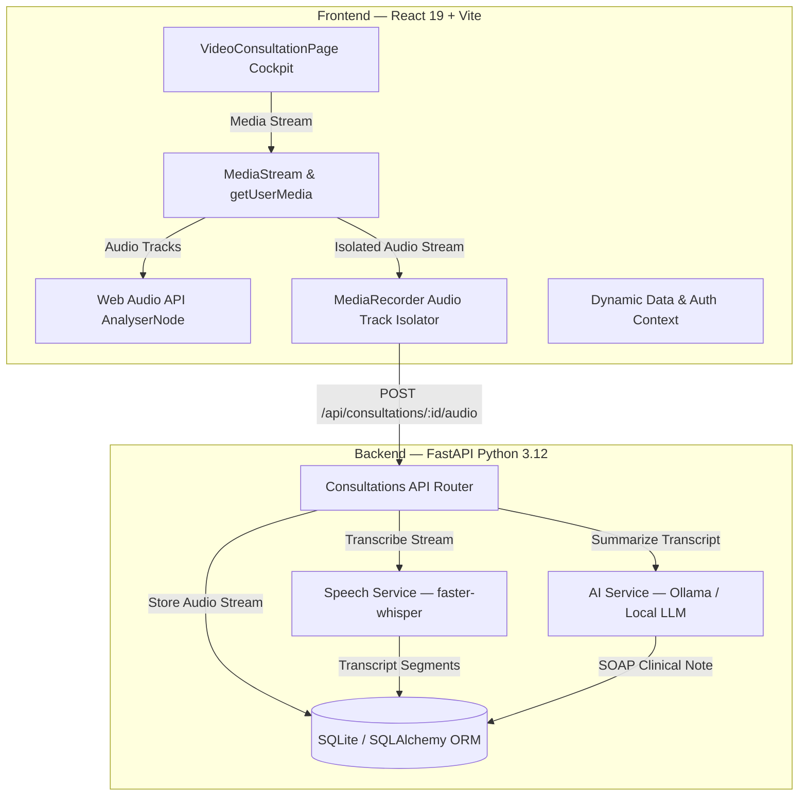

# KENKO-AI MediBridge — Telehealth Video Consultation Architecture & UI/UX Technical Guide

> **Document Version:** 1.0.0  
> **Target Audience:** AI Engineering Agents, Clinical Product Designers, Full-Stack Developers  
> **System Scope:** Privacy-Preserving Telehealth Video Cockpit, Real-Time Audio Capture, Offline STT (faster-whisper), Local LLM Clinical Extraction (Ollama), and EHR SOAP Integration.

---

## 1. Executive System Overview

**KENKO-AI MediBridge Telehealth** is an offline-capable, privacy-preserving clinical teleconsultation platform. It enables clinicians and patients to conduct encrypted real-time video consultations while capturing ambient clinical dialogue. 

### Core Architectural Principles
1. **Zero-Cloud Audio Privacy:** Raw patient audio never leaves the local machine. Speech recognition is executed locally via CTranslate2 `faster-whisper`, and clinical SOAP extraction is powered locally by `Ollama` (MedLlama / Llama 3).
2. **Deterministic Data Binding:** No fake patients or simulated dialogues in production flows. All metadata (patient identity, medical history, telemetry vitals, transcribed speech segments, and doctor signatures) is dynamically retrieved and synchronized with the backend database.
3. **High-Fidelity Clinical Cockpit:** Designed around an asymmetric 12-column medical layout with floating dock controls, real-time audio equalizers, interactive Picture-in-Picture (PiP), collapsible clinical notes, and interactive hardware diagnostics.

---

## 2. Complete Technology Stack



| Layer | Technologies & Libraries | Key Responsibilities |
| :--- | :--- | :--- |
| **Frontend Framework** | React 19, React Router v7, Vite | Component rendering, state management, routing |
| **Styling & Icons** | Vanilla CSS Tokens, Google Material Symbols, Inter Typography | High-fidelity dark mode cockpit, fluid animations |
| **Media & Audio APIs** | Web Audio API (`AudioContext`, `AnalyserNode`), `MediaRecorder`, `getUserMedia`, `enumerateDevices`, `getDisplayMedia` | Camera feed, mic capture, real-time EQ bars, acoustic chime |
| **Backend Framework** | FastAPI, Uvicorn, Python 3.12 | REST endpoints, file streaming, multipart uploads |
| **Speech-to-Text (STT)** | `faster-whisper` (CTranslate2 int8) | Offline ambient speech transcription & speaker diarization |
| **Clinical Intelligence** | `Ollama` (Local MedLlama / Llama 3) | S-O-A-P synthesis, ICD-10 extraction, quote tracing |
| **Persistence** | SQLite, SQLAlchemy, Pydantic v2 | Consultations, transcripts, clinical summaries, audit logs |

---

## 3. End-to-End Workflow & State Machine

```
[Start Consultation / Direct URL ?id=XYZ]
                     │
                     ▼
       Load Existing Consultation Metadata
       (Patient, Doctor, History, Vitals)
                     │
                     ▼
         Initialize Camera + Microphone
       (Web Audio AnalyserNode -> Real EQ)
                     │
                     ▼
     Explicit Informed Consent Verification
     (Controlled Checkbox Modal Validation)
                     │
                     ▼
    Start Recording (MediaRecorder opus/webm)
    (Audio-Only Track Isolation to prevent format errors)
                     │
                     ▼
           Stop Recording / End Call
                     │
                     ▼
          POST /audio (Upload Audio Blob)
                     │
                     ▼
        POST /transcribe (faster-whisper)
                     │
                     ▼
        POST /summarize (Ollama SOAP LLM)
                     │
                     ▼
       Preview Post-Call SOAP Note Modal
                     │
                     ▼
      Doctor Verification -> Workspace Sync
```

---

## 4. UI / UX Design & Component Breakdown

### 4.1. Top Header App Bar (`.telehealth-header`)
* **Branding:** `K` logo with `KENKO AI Telehealth` and navigation tabs (*Live Consultation*, *EHR Sync*, *Clinical Protocols*).
* **Consultation Meta Pill:** Dynamic `#KENKO-{ID}` badge with green animated pulsing connection dot (`Connected`).
* **Session Timer:** Real-time running timer (`sessionTimer`).
* **Security & Telemetry Badges:** HIPAA Encrypted badge and network signal latency indicator (`24ms`).
* **Header Actions:**
  * Device Settings trigger (`modalDeviceSettingsOpen`)
  * Pre-Call Diagnostics trigger (`modalHwCheckOpen`)
  * Clinical Dock toggle (`sidebarOpen`)
  * **End Session** action (`modalEndCallOpen`)

---

### 4.2. Main Left Video Stage (`.telehealth-stage`)
* **Feed Mode Switcher (`.stream-toolbar`):**
  * `Active Stream`: Full video room with clinician feed and patient PiP.
  * `Camera Off`: Clinician avatar badge, name, department, and bandwidth conservation status.
  * `Waiting for Doctor`: Animated spinner with clinical intake status and estimated wait time.
* **Video Feed Canvas (`.video-feed-canvas`):**
  * **Clinician Hero Feed:** Renders clinician portrait/stream with top-left Doctor credentials badge (`Dr. Marcus Vance, MD`, Cardiology, Room 04).
  * **Stream Health Overlay:** Top-right latency and frame health (`1080p 60fps | 24ms Jitter <1ms`).
  * **Real-Time EQ Audio Visualizer:** 4 equalizer bars animated in real-time by a Web Audio `AnalyserNode` connected to the active microphone stream.
  * **Patient Self-View PiP (`.patient-pip-window`):**
    * Attaches local camera stream to `<video ref={patientVideoRef} />`.
    * Supports camera-off fallback.
    * **Interactive Flip:** Clicking the PiP swaps the clinician and patient video positions.

---

### 4.3. Collapsible Live Transcript Drawer (`.transcript-drawer`)
* **Header:** Title, listening status indicator, confidence rating (98.4%), **Toggle Empty Preview**, and **Export Transcript** (downloads a certified text document).
* **Scroll Area (`.transcript-scroll-area`):**
  * Renders dialogue rows with speaker tags (`Doctor` in primary blue, `Patient` in secondary teal), timestamps, and speech text.
  * Automatically smooth-scrolls to the bottom upon arrival of new speech segments.

---

### 4.4. Floating Bottom Call Control Dock (`.floating-call-dock`)
* **Microphone Toggle:** Directly controls `track.enabled` on all audio tracks in `streamRef.current`.
* **Camera Toggle:** Directly controls `track.enabled` on all video tracks in `streamRef.current`.
* **Screen Share:** Invokes `navigator.mediaDevices.getDisplayMedia({ video: true })`.
* **Speaker Output:** Triggers dual-tone harmonic acoustic test tone ($523.25\text{ Hz} \rightarrow 659.25\text{ Hz}$).
* **Recording Action:** Starts/stops recording, uploads audio, and triggers transcription.
* **Device Settings:** Opens physical device selection modal.
* **More Options Menu:** Quick access to Hardware Diagnostics, Post-Call SOAP preview, and incident reporting.
* **End Call:** Triggers confirmation dialog.

---

### 4.5. Right Collapsible Clinical Dock (`.clinical-dock`)
* **Header:** Clinical Dock title, ID badge, and `EHR Synced` status.
* **Segmented Tabs:**
  1. **Patient Vitals Tab:**
     * *Authenticated Patient Card:* Dynamic name, age, gender, ID, language, documented allergy alerts (e.g. Penicillin), and scheduled reason.
     * *Synchronized Vitals:* Live telemetry feed showing Resting Heart Rate ($72\text{ bpm}$), Blood Pressure ($118/76\text{ mmHg}$), and $\text{SpO}_2$ ($99\%$).
     * *Consulting Clinician:* Doctor name, state medical license (`#MED-94021`), department, and pavilion location.
     * *Past Diagnoses:* Checklist of medical history.
  2. **AI Clinical Notes Tab:**
     * Real-time detected symptoms with **ICD-10** codes (e.g., `R00.2`, `R42`).
     * Dosage & protocol cross-check with allergy verification.
     * Recommended clinical inquiry prompts.
* **Footer:** **Export SOAP Note** button with HIPAA audit hash and session vault access.

---

### 4.6. Modals & Drawers
1. **End Consultation Confirmation Modal:** Confirms session termination and offers immediate AI SOAP compilation.
2. **Pre-Call Hardware Diagnostics Check Modal:** Verifies camera hardware, microphone input with dynamic volume meter, and interactive speaker test sound.
3. **Audio & Video Settings Modal:** Uses `navigator.mediaDevices.enumerateDevices()` to populate physical hardware choices (Camera source, Microphone array, Speaker output) and background privacy blur.
4. **Post-Consultation SOAP Note Modal:** Displays complete clinical **Subjective**, **Objective**, **Assessment**, and **Plan** note with doctor sign-off and **Sign & Sync to EHR** action.
5. **Informed Consent Modal:** Ensures explicit patient consent before recording starts.

---

## 5. Hardware & Web API Technical Implementations

### 5.1. Audio Track Isolation for MediaRecorder
Chromium and Safari throw `DOMException: Failed to execute 'start' on 'MediaRecorder'` if an audio MIME type (`audio/webm;codecs=opus`) is supplied to a stream that contains both video and audio tracks.

**Solution in `VideoConsultationPage.jsx`:**
```javascript
// Extract ONLY audio tracks to create a pure audio MediaStream
const audioTracks = streamRef.current.getAudioTracks();
const audioOnlyStream = new MediaStream(audioTracks);

// Check MIME type support with graceful fallback
let options = {};
if (MediaRecorder.isTypeSupported('audio/webm;codecs=opus')) {
  options = { mimeType: 'audio/webm;codecs=opus' };
} else if (MediaRecorder.isTypeSupported('audio/webm')) {
  options = { mimeType: 'audio/webm' };
}

const mediaRecorder = new MediaRecorder(audioOnlyStream, options);
```

### 5.2. Real-Time Web Audio Equalizer
```javascript
const audioCtx = new (window.AudioContext || window.webkitAudioContext)();
const source = audioCtx.createMediaStreamSource(stream);
const analyser = audioCtx.createAnalyser();
analyser.fftSize = 64;
source.connect(analyser);

const dataArray = new Uint8Array(analyser.frequencyBinCount);
function updateEQ() {
  analyser.getByteFrequencyData(dataArray);
  const b1 = Math.max(3, Math.min(18, Math.round((dataArray[1] / 255) * 18)));
  const b2 = Math.max(4, Math.min(20, Math.round((dataArray[3] / 255) * 20)));
  const b3 = Math.max(3, Math.min(18, Math.round((dataArray[5] / 255) * 18)));
  const b4 = Math.max(2, Math.min(16, Math.round((dataArray[7] / 255) * 16)));
  setAudioVolumeBars([b1, b2, b3, b4]);
  requestAnimationFrame(updateEQ);
}
```

### 5.3. Harmonic Acoustic Chime Generator
Synthesizes a pleasant dual-frequency harmonic tone ($C_5 = 523.25\text{ Hz} \rightarrow E_5 = 659.25\text{ Hz}$) with linear ramp attack and exponential decay:
```javascript
const osc = audioCtx.createOscillator();
const gain = audioCtx.createGain();
osc.type = 'sine';
osc.frequency.setValueAtTime(523.25, now);
gain.gain.linearRampToValueAtTime(0.12, now + 0.04);
gain.gain.exponentialRampToValueAtTime(0.001, now + 0.6);
```

---

## 6. Backend API Contracts & Schema Reference

### 6.1. Retrieve Consultation
* **Endpoint:** `GET /api/consultations/{id}`
* **Response:**
```json
{
  "consultation": {
    "id": "uuid-string",
    "patient_name": "Elena Rostova",
    "patient_id": "PT-80291",
    "patient_age": 42,
    "patient_gender": "Female",
    "doctor_name": "Dr. Marcus Vance, MD",
    "consultation_type": "video",
    "status": "IN_PROGRESS",
    "has_consent": true
  },
  "transcript": [],
  "summary": null
}
```

### 6.2. Upload Audio Recording
* **Endpoint:** `POST /api/consultations/{id}/audio`
* **Form Data:**
  * `audio`: Binary Audio Blob (`audio/webm` or `audio/wav`)
  * `duration_seconds`: Integer
* **Response:**
```json
{
  "status": "success",
  "audio_path": "backend/uploads/consultation_xyz.webm",
  "duration_seconds": 185
}
```

### 6.3. Trigger Transcription
* **Endpoint:** `POST /api/consultations/{id}/transcribe`
* **Processing:** `faster-whisper` CTranslate2 model executes on CPU/GPU.
* **Response:**
```json
{
  "status": "success",
  "segments_count": 8,
  "language": "en",
  "segments": [
    {
      "id": 1,
      "speaker": "Doctor",
      "start_time": 0.0,
      "end_time": 4.5,
      "text": "Good morning, Elena. How are you feeling today?"
    }
  ]
}
```

### 6.4. Generate Clinical Summary
* **Endpoint:** `POST /api/consultations/{id}/summarize`
* **Processing:** `Ollama` formats transcript into structured S-O-A-P summary with quote references.
* **Response:**
```json
{
  "status": "success",
  "chief_complaint": "Post-Operative Cardiovascular Follow-up",
  "symptoms": ["Nocturnal palpitations", "Morning dizziness"],
  "assessment": "Normal hemodynamic recovery post-cardiac surgery.",
  "treatment_plan": "Continue Metoprolol Tartrate 25mg oral twice daily.",
  "medications": [
    { "name": "Metoprolol Tartrate", "dosage": "25mg", "frequency": "BID" }
  ],
  "follow_up": {
    "timeframe": "30 days",
    "modality": "Virtual Telehealth"
  }
}
```

---

## 7. Developer & AI Assistant Quick Start

### Starting the Backend
```bash
# In repository root
python -m uvicorn app.main:app --host 127.0.0.1 --port 8000 --reload
```

### Starting the Frontend
```bash
# In repository root
npm run dev
```

### Running Validation Suites
```bash
# Run backend integration tests
python -m pytest backend/tests/test_medibridge_integration.py

# Run frontend build check
npm run build
```

---

## 8. Summary of Relevant File Paths

* **Frontend Telehealth Component:** [`src/pages/VideoConsultationPage.jsx`](file:///c:/Users/prasanth/OneDrive/Desktop/KENKO-AI/src/pages/VideoConsultationPage.jsx)
* **Frontend Cockpit Styling:** [`src/pages/VideoConsultationPage.css`](file:///c:/Users/prasanth/OneDrive/Desktop/KENKO-AI/src/pages/VideoConsultationPage.css)
* **Frontend API Client:** [`src/services/api.js`](file:///c:/Users/prasanth/OneDrive/Desktop/KENKO-AI/src/services/api.js)
* **Backend Consultations Router:** [`backend/app/routes/consultations.py`](file:///c:/Users/prasanth/OneDrive/Desktop/KENKO-AI/backend/app/routes/consultations.py)
* **Backend Speech Service:** [`backend/app/services/speech.py`](file:///c:/Users/prasanth/OneDrive/Desktop/KENKO-AI/backend/app/services/speech.py)
* **Backend AI Clinical Service:** [`backend/app/services/ai_service.py`](file:///c:/Users/prasanth/OneDrive/Desktop/KENKO-AI/backend/app/services/ai_service.py)
* **Backend Database Models:** [`backend/app/models/db_models.py`](file:///c:/Users/prasanth/OneDrive/Desktop/KENKO-AI/backend/app/models/db_models.py)
* **Integration Test Suite:** [`backend/tests/test_medibridge_integration.py`](file:///c:/Users/prasanth/OneDrive/Desktop/KENKO-AI/backend/tests/test_medibridge_integration.py)
