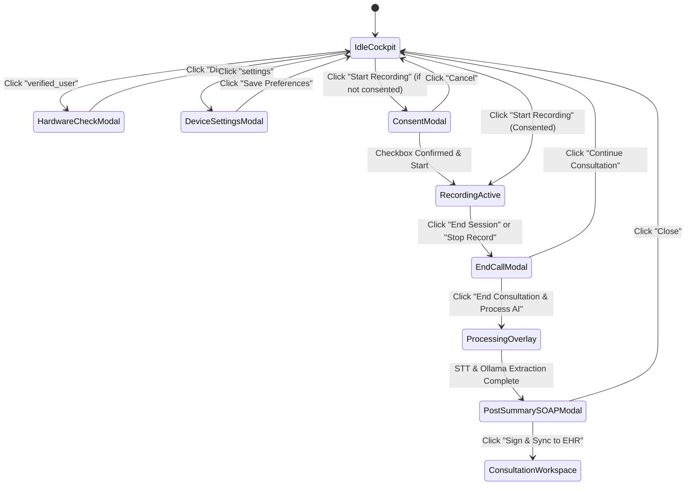

# KENKO-AI MediBridge — Telehealth Live Consultation UI & UX Design Specification

> **Document Type:** Complete UI/UX Design System, Wireframes & Component Interaction Specification  
> **Target Audience:** UI/UX Designers, Frontend Engineers, Clinical Ergonomics Auditors, AI Agents  
> **Companion Document:** [`TELEHEALTH_SYSTEM_ARCHITECTURE.md`](file:///c:/Users/prasanth/OneDrive/Desktop/KENKO-AI/TELEHEALTH_SYSTEM_ARCHITECTURE.md)

---

## 1. Design Philosophy & Clinical Ergonomics

The **KENKO-AI Telehealth Live Consultation Cockpit** is engineered for high-stress, high-cognition clinical environments. It balances **zero-distraction video presence** with **rich, synchronized ambient telemetry and live AI intelligence**.

### Core UX Principles
1. **Unobtrusive Cognitive Support:** Ambient transcription, telemetry vitals, and AI recommendations sit in peripheral docks without occluding the patient-clinician facial connection.
2. **Instant Physical Feedback:** Audio input levels, mute statuses, camera feeds, and recording states provide immediate visual and acoustic confirmation.
3. **Fail-Safe Clinical Flow:** High-consequence actions (ending consultations, signing SOAP notes, starting recordings) require clear confirmations with zero data loss.
4. **Natural Motion & Acoustics:** Soft glassmorphic elevations, realistic bouncing EQ frequency visualizers, and dual-harmonic acoustic chimes replace harsh digital beeps.

---

## 2. Design System & Style Tokens

### 2.1. Color Palette

```
┌────────────────────────────────────────────────────────────────────────┐
│ CLINICAL COLOR TOKENS                                                  │
├──────────────────────┬─────────────┬───────────────────────────────────┤
│ Token Name           │ Hex Value   │ Role / Usage                      │
├──────────────────────┼─────────────┼───────────────────────────────────┤
│ Background           │ #090d16     │ Cockpit outer base                │
│ Canvas Deep          │ #020617     │ High-contrast video feed canvas   │
│ Surface Dark         │ #0f172a     │ Glass cards, modals, side panels  │
│ Surface Light (Doc)  │ #ffffff     │ Light mode containers             │
│ Primary Blue         │ #0284c7     │ Active CTA, Doctor tags, links    │
│ Primary Glow         │ #38bdf8     │ Highlights, active indicators     │
│ Secondary Teal       │ #0d9488     │ Patient speaker badge, vitals     │
│ Tertiary Green       │ #16a34a     │ Safe vitals, connected status     │
│ Warning Amber        │ #fbbf24     │ Camera-off / bandwidth notices    │
│ Error Rose           │ #e11d48     │ End call, allergies, mute badges  │
│ Text Primary         │ #f8fafc     │ Headings, high-contrast values    │
│ Text Secondary       │ #94a3b8     │ Labels, metadata, timestamps      │
│ Border Glass         │ rgba(...)   │ rgba(255, 255, 255, 0.08)         │
└──────────────────────┴─────────────┴───────────────────────────────────┘
```

### 2.2. Typography Scale (Inter Font Family)

* **Display / Brand:** `15px / 700` (`letter-spacing: -0.01em`)
* **Headline MD (Modals):** `18px / 700`
* **Headline SM (Cards):** `14px / 700`
* **Body Normal:** `13px / 400` (`line-height: 1.5`)
* **Body Small / Notes:** `11px - 12px / 400`
* **Label Tiny / Badges:** `10px / 700` (`text-transform: uppercase`)
* **Monospace (Telemetry/Timers):** `ui-monospace, SFMono-Regular, monospace`

---

## 3. Cockpit Wireframe & Layout Grid

The cockpit uses an asymmetric **12-column medical layout**:
* **Columns 1 to 8:** Video Stage, Picture-in-Picture (PiP), Floating Call Control Dock, and Collapsible Live Transcript Drawer.
* **Columns 9 to 12:** Collapsible Clinical Dock with Segmented Tabs (*Patient Vitals* & *AI Clinical Notes*).

```
┌───────────────────────────────────────────────────────────────────────────────────────────────────────┐
│ [K] KENKO AI Telehealth  [Live Consultation] [EHR Sync] [Protocols]   #KENKO-8492 ● Connected   [12:48] [End] │
├────────────────────────────────────────────────────────────────────────┬──────────────────────────────┤
│ Feed Mode: [Active Stream] [Camera Off] [Waiting for Doctor]           │ 🗎 Clinical Dock   [EHR Synced]│
├────────────────────────────────────────────────────────────────────────┼──────────────────────────────┤
│                                                                        │ [Patient Vitals] [AI Notes]  │
│  ┌──────────────────────────────────────────────────────────────────┐  │ ┌──────────────────────────┐ │
│  │ ● Dr. Marcus Vance, MD (Cardiology)          1080p 60fps | 24ms │  │ │ Elena Rostova (42F)      │ │
│  │                                                                  │  │ │ ID: PT-80291 [Verified]  │ │
│  │                   [ CLINICIAN VIDEO FEED ]                       │  │ │ Allergy: ⚠ Penicillin    │ │
│  │                                                                  │  │ └──────────────────────────┘ │
│  │                                                                  │  │ ┌──────────────────────────┐ │
│  │                                            ┌──────────────────┐  │  │ │ Vitals: HR 72 | BP 118/76 │ │
│  │                                            │ Patient Self-PiP │  │  │ └──────────────────────────┘ │
│  │  🎙 ılıl Input: Normal                      │ [Click to Flip]  │  │  │ ┌──────────────────────────┐ │
│  │                                            └──────────────────┘  │  │ │ Diagnoses: Mitral Post-Op│ │
│  └──────────────────────────────────────────────────────────────────┘  │ └──────────────────────────┘ │
│                     ┌────────────────────────────────┐                 │                              │
│                     │ 🎤   📹   🖥   🔊   ⏺   ⚙    │                 │ [ Export SOAP Note ]         │
│                     └────────────────────────────────┘                 │                              │
├────────────────────────────────────────────────────────────────────────┼──────────────────────────────┤
│ 🗩 LIVE TRANSCRIPT  ● Listening... 98.4% Confidence   [Toggle Preview] [Export]                        │
│ [10:41:02] Doctor: Good morning Elena. Echocardiogram ejection fraction is holding at 58%...          │
│ [10:41:24] Patient: Dizziness subsided after day three. Resting heart rate stayed under 78 bpm...     │
└───────────────────────────────────────────────────────────────────────────────────────────────────────┘
```

---

## 4. Component-by-Component Interaction Specifications

### 4.1. Top Header Bar (`.telehealth-header`)

| UI Element | Visual Representation | Interaction / Behavior |
| :--- | :--- | :--- |
| **Brand Badge** | `K` logo inside gradient container | Returns to dashboard or overview |
| **Navigation Links** | *Live Consultation* (Active), *EHR Sync*, *Protocols* | Displays active indicator; triggers synchronization feedback toasts |
| **Consultation Pill** | `#KENKO-8492` + Green pulsing dot | Displays session unique ID and real-time WebRTC connectivity |
| **Session Timer** | `timer` icon + `12:48` | Real-time elapsed consultation timer incremented every second |
| **HIPAA Badge** | `lock` icon + `HIPAA Encrypted` | Reassures participants that streaming is tamper-evident & local |
| **Signal Latency** | `signal_cellular_alt` + `24ms` | Displays real-time round-trip latency |
| **Device Settings Trigger** | `settings` circle button | Opens Audio & Video Device Settings modal |
| **Diagnostics Trigger** | `verified_user` circle button | Opens Pre-Call Hardware Diagnostics modal |
| **Dock Toggle** | `dock_to_right` / `view_sidebar` | Expands or collapses the right Clinical Dock for full-screen video |
| **End Session CTA** | Red pill button `call_end` | Opens the End Consultation confirmation modal |

---

### 4.2. Video Feed Canvas & Floating Dock

#### A. Clinician Hero Video Feed
* Displays high-definition feed of the attending physician.
* **Doctor Overlay Badge:** Shows doctor name, specialty badge (*Cardiology* in emerald), and room designation.
* **Feed Health Badge:** Displays `1080p 60fps | 24ms Jitter <1ms`.
* **Live Audio Equalizer:** 4 vertical bars calculating real-time audio volume from the user's microphone via `AnalyserNode`.

#### B. Patient Picture-in-Picture (PiP) Window
* Floating self-view anchored at bottom-right of the video stage.
* Displays local camera stream via `<video autoPlay playsInline muted />`.
* Displays patient first name and dynamic microphone status badge.
* **Click-to-Flip Interaction:** Clicking the PiP swaps positions, allowing the user to inspect their own feed in full size while moving the clinician to the PiP.

#### C. Floating Call Control Dock (`.floating-call-dock`)
Anchored $185\text{px}$ from the bottom with ultra-high contrast glassmorphism:
1. **Mic Toggle (`#btnMic`):** Toggles audio tracks (`track.enabled = !track.enabled`). Turns red with `mic_off` when muted.
2. **Camera Toggle (`#btnCam`):** Toggles video tracks. Renders smooth fallback avatar when disabled.
3. **Screen Share (`#btnShare`):** Triggers `getDisplayMedia` for reviewing radiology scans or intake forms.
4. **Speaker Output (`#btnSpeaker`):** Plays acoustic harmonic test chime.
5. **Recording Action Button:**
   - *Standby:* Blue outline `radio_button_checked`.
   - *Recording Active:* Glowing red `stop` with pulse animation.
6. **Device Settings (`#btnSettings`):** Opens hardware selector.
7. **More Options Menu (`#btnMore`):** Drops up hardware diagnostics, SOAP preview, and incident reporting.
8. **End Call (`#btnEnd`):** Red circle CTA opening confirmation dialog.

---

### 4.3. Collapsible Live Transcript Drawer (`.transcript-drawer`)

* **Drawer Height:** $175\text{px}$ (Collapsible to $42\text{px}$ via header control).
* **Header Controls:**
  * Title with `subtitles` icon.
  * Green `Listening...` badge with pulsing dot.
  * Live confidence metric (`98.4%`).
  * `Toggle Empty Preview` button (for testing empty states).
  * `Export` button (generates certified `.txt` transcript file).
* **Dialogue Rows:**
  * Doctor messages flagged with primary blue badge (`Doctor`).
  * Patient messages flagged with secondary teal badge (`Patient`).
  * Exact timestamps (`10:41:02`).
  * Smooth auto-scrolling maintains latest speech at the bottom.

---

### 4.4. Right Collapsible Clinical Dock (`.clinical-dock`)

#### Tab 1: Patient Vitals (`tabBtn-patient`)
1. **Authenticated Patient Card:**
   - Patient full name, age, gender, and ID.
   - Green verified badge.
   - Preferred language.
   - **Documented Allergy Alert:** Highlighted in red with warning icon (e.g. `⚠ Penicillin`).
   - Scheduled reason for visit.
2. **Synchronized Telemetry Vitals:**
   - Resting Heart Rate ($72\text{ bpm}$ in green).
   - Blood Pressure ($118/76\text{ mmHg}$).
   - $\text{SpO}_2$ ($99\%$ in primary blue).
3. **Consulting Clinician Card:**
   - Doctor full name, fellowship credentials (`FACC`), state medical license (`#MED-94021`), department, and location.
4. **Past Diagnoses Checklist:**
   - Pre-existing conditions and surgical status.

#### Tab 2: AI Clinical Copilot (`tabBtn-ai`)
1. **AI Assistance Disclaimer:** Informs clinician that AI-extracted entities require doctor sign-off.
2. **Detected Symptoms Card:**
   - Entity names (e.g., *Transient Nocturnal Palpitations*, *Post-Dose Dizziness*).
   - Real-time matched **ICD-10** codes (`R00.2`, `R42`).
   - Timestamped quotes from patient conversation.
3. **Dosage & Protocol Cross-Check:**
   - Medication verification (e.g. `Metoprolol Tartrate 25mg BID Safe`).
   - Cross-checks against patient allergy profile and vitals.
4. **Recommended Clinical Inquiries:**
   - Suggests relevant follow-up questions for the doctor to ask.

#### Dock Footer
* **Export SOAP Note Button:** Large primary CTA opening post-consultation modal.
* **HIPAA Audit Trail & Session Vault Links:** Access cryptographic logs.

---

## 5. Modal & Dialog UX Flows



### Modal Details

1. **End Consultation Confirmation Dialog (`#modalEndCall`):**
   - Warning icon in red circular badge.
   - Clear summary of automated SOAP note generation.
   - Primary and secondary dismissal buttons.
2. **Pre-Call Hardware Diagnostics Check (`#modalHwCheck`):**
   - Camera hardware status (*Working* in green).
   - Microphone input with live bouncing volume meter.
   - Audio output test sound button playing dual-harmonic chime.
3. **Audio & Video Settings Modal (`#modalDeviceSettings`):**
   - Populates dynamically from `navigator.mediaDevices.enumerateDevices()`.
   - Camera source selector.
   - Microphone selector.
   - Audio output speaker selector.
   - Background privacy blur checkbox toggle.
4. **Post-Consultation Summary Overlay / SOAP Modal (`#modalPostSummary`):**
   - Blue gradient header with description.
   - Tamper-evident HIPAA vault status banner with `SHA-256 Validated` tag.
   - 4 Structured Sections:
     - **S - Subjective:** Patient reports, timeline, and symptoms.
     - **O - Objective:** Telemetry vitals, physical observations, incision site checks.
     - **A - Assessment:** Clinical diagnosis and recovery trajectory.
     - **P - Plan:** Medication instructions, dosage, ambulatory logs, follow-up timeline.
   - Signee footer with attending doctor signature and **Sign & Sync to EHR** action.

---

## 6. Micro-Interactions & Acoustic Feedback

### 6.1. Acoustic Chime Specification
When the user tests audio output, the system synthesizes a calming, clinical-grade harmonic chord:
* **Fundamental Note:** $C_5$ ($523.25\text{ Hz}$) with $40\text{ms}$ attack and $600\text{ms}$ exponential decay.
* **Harmonic Note:** $E_5$ ($659.25\text{ Hz}$) with $40\text{ms}$ attack and $750\text{ms}$ exponential decay.
* **Result:** A peaceful 2-tone chime that reassures the participant without causing auditory fatigue.

### 6.2. Live Equalizer Dynamic Scaling
```
Mic Amplitude -> AnalyserNode Frequency Bin [1..7]
            ↓
Bar 1 Height = clamp(3px, (data[1]/255) * 18px, 18px)
Bar 2 Height = clamp(4px, (data[3]/255) * 20px, 20px)
Bar 3 Height = clamp(3px, (data[5]/255) * 18px, 18px)
Bar 4 Height = clamp(2px, (data[7]/255) * 16px, 16px)
```

---

## 7. Responsive Breakpoints & Accessibility (a11y)

### 7.1. Viewport Adaptation
* **Desktop ($> 1200\text{px}$):** Full 12-column cockpit with side-by-side video stage and clinical dock.
* **Laptop ($1024\text{px} - 1200\text{px}$):** Video stage adapts; clinical dock slides in from right via toggle button.
* **Tablet / Mobile ($< 1024\text{px}$):** Video stage occupies 100% width; floating dock centers horizontally; clinical dock opens as a full-screen drawer overlay.

### 7.2. Accessibility Standards
* High-contrast text compliance ($\ge 4.5:1$ ratio on dark canvas).
* Descriptive `aria-label` and `title` attributes on all circular dock icon buttons.
* Full keyboard tab navigation for dialog dismissals and form controls.
* Visual indicators accompanying every color state (e.g. text badges alongside green/red dots).

---

## 8. Summary of UI Source Files

* **Main Video Page Component:** [`src/pages/VideoConsultationPage.jsx`](file:///c:/Users/prasanth/OneDrive/Desktop/KENKO-AI/src/pages/VideoConsultationPage.jsx)
* **Cockpit Style Sheet:** [`src/pages/VideoConsultationPage.css`](file:///c:/Users/prasanth/OneDrive/Desktop/KENKO-AI/src/pages/VideoConsultationPage.css)
* **Global Typography & HTML Entry:** [`index.html`](file:///c:/Users/prasanth/OneDrive/Desktop/KENKO-AI/index.html)
* **System Architecture Companion:** [`TELEHEALTH_SYSTEM_ARCHITECTURE.md`](file:///c:/Users/prasanth/OneDrive/Desktop/KENKO-AI/TELEHEALTH_SYSTEM_ARCHITECTURE.md)
